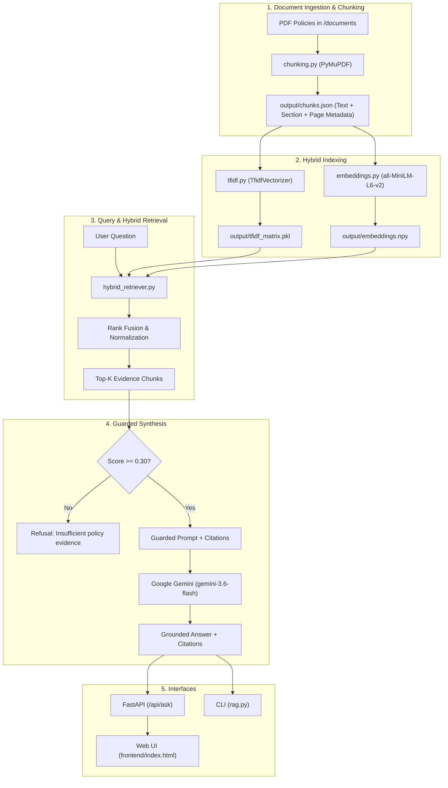

# Policy Lens / CareAssist — Hospital Policy Intelligence Assistant

A grounded, hallucination-resistant **Retrieval-Augmented Generation (RAG)** system designed for hospital staff, clinicians, and administrative teams. Policy Lens provides fast, verifiable, and strictly sourced answers to hospital operational, administrative, and compliance policy questions.

---

## Table of Contents

- [Overview](#overview)
- [Key Features](#key-features)
- [System Architecture](#system-architecture)
- [Project Structure](#project-structure)
- [Prerequisites](#prerequisites)
- [Installation & Setup](#installation--setup)
- [Environment Configuration](#environment-configuration)
- [Indexing Pipeline (How It Works)](#indexing-pipeline-how-it-works)
- [Running the Application](#running-the-application)
  - [1. Web Interface & REST API](#1-web-interface--rest-api)
  - [2. Interactive Terminal CLI](#2-interactive-terminal-cli)
- [API Reference](#api-reference)
- [Guardrails & Anti-Hallucination Rules](#guardrails--anti-hallucination-rules)
- [Git & Security Best Practices](#git--security-best-practices)

---

## Overview

Hospitals operate under strict clinical, administrative, and statutory regulations. Misinterpreting admission criteria, insurance cashless pre-authorization, patient record retention, or visitor curfews carries severe compliance and operational risks.

**Policy Lens** solves this by coupling dense semantic vector search with sparse lexical retrieval (TF-IDF) over official hospital policy PDFs. Queries are grounded with exact document citations (Document Name, Policy ID, Section, Page Numbers) and synthesized via Google Gemini.

---

## Key Features

- **Hybrid Search Engine**: Combines sentence-transformers (`all-MiniLM-L6-v2`) dense embeddings with scikit-learn TF-IDF sparse matching for superior recall on specialized medical/administrative terminology.
- **Strict Anti-Hallucination Guardrails**:
  - Requires a minimum confidence threshold (`MIN_HYBRID_SCORE = 0.30`).
  - Standard refusal response when policy evidence is insufficient.
  - Zero extrapolation: answers only reflect supplied hospital policy documents.
- **Auditable Citations**: Every generated answer links back to the exact PDF title, policy ID, section, and page number.
- **Modern Responsive Web UI**: Clean, accessible web interface with dark/light mode, real-time typing animation, suggested queries, and expandable source inspector.
- **RESTful FastAPI Backend**: Async endpoints with CORS support, request validation via Pydantic, and static asset serving.
- **Interactive CLI**: Standalone command-line testing mode for rapid debugging and evaluation.

---

## System Architecture



---

## Project Structure

```text
hackathon_man/
├── .env.example              # Template for environment variables (GEMINI_API_KEY)
├── .gitignore                # Ignores .env, virtual environments (myenv/), __pycache__, etc.
├── README.md                 # Project documentation
├── requirements.txt          # Python dependencies
├── api.py                    # FastAPI server & static file host
├── rag.py                    # Core RAG pipeline controller & CLI mode
├── hybrid_retriever.py       # Hybrid retrieval (TF-IDF + Dense vector fusion)
├── chunking.py               # PDF parser, structure detection & text chunker
├── embeddings.py             # Generates semantic embeddings with SentenceTransformer
├── tfidf.py                  # Generates TF-IDF vectorizer and sparse matrix
├── llm.py                    # Google Gemini client and prompt guardrails
├── documents/                # Source hospital policy PDF files
│   ├── 00_source_reference_notes.pdf
│   ├── 01_admission_registration_policy.pdf
│   ├── 02_billing_payment_policy.pdf
│   ├── 03_insurance_cashless_policy.pdf
│   ├── 04_visitor_access_policy.pdf
│   ├── 05_discharge_process_policy.pdf
│   ├── 06_staff_administrative_policy.pdf
│   ├── 07_governance_meetings_policy.pdf
│   ├── 08_patient_records_policy.pdf
│   └── 09_appointments_outpatient_policy.pdf
├── frontend/                 # Web interface assets
│   ├── index.html            # Main web UI
│   ├── css/
│   │   └── style.css         # UI stylesheet (light & dark mode)
│   └── js/
│       └── app.js            # Frontend logic & API interaction
└── output/                   # Generated index artifacts (reproducible)
    ├── chunks.json           # Chunked policy segments with metadata
    ├── embeddings.npy        # Dense vector array (SentenceTransformer)
    ├── tfidf_matrix.pkl      # Sparse TF-IDF document matrix
    └── tfidf_vectorizer.pkl  # Trained Scikit-Learn TF-IDF vectorizer
```

---

## Prerequisites

- **Python 3.10+** installed on your system.
- A **Google Gemini API Key** (Free tier available via [Google AI Studio](https://aistudio.google.com/)).
- Git installed (optional, for version control).

---

## Installation & Setup

### 1. Clone or Open the Repository

```bash
git clone <your-repository-url>
cd hackathon_man
```

### 2. Create a Virtual Environment

It is recommended to use a virtual environment such as `myenv`:

#### Windows (PowerShell):
```powershell
python -m venv myenv
.\myenv\Scripts\Activate.ps1
```

> **Note for Windows**: If script execution is restricted, run:  
> `Set-ExecutionPolicy -Scope Process -ExecutionPolicy Bypass`

#### Windows (Command Prompt):
```cmd
python -m venv myenv
myenv\Scripts\activate.bat
```

#### macOS / Linux:
```bash
python3 -m venv myenv
source myenv/bin/activate
```

### 3. Install Dependencies

```bash
pip install -r requirements.txt
```

---

## Environment Configuration

1. Copy the provided `.env.example` file to create your own `.env`:

   **Windows (PowerShell):**
   ```powershell
   Copy-Item .env.example .env
   ```

   **macOS / Linux:**
   ```bash
   cp .env.example .env
   ```

2. Open `.env` in any text editor and paste your Google Gemini API key:
   ```env
   GEMINI_API_KEY=your_actual_gemini_api_key_here
   ```

> [!IMPORTANT]
> Never commit your `.env` file to Git! The `.gitignore` file is pre-configured to ignore `.env`, your virtual environment (`myenv/`), and cache files.

---

## Indexing Pipeline (How It Works)

Pre-computed index artifacts are already provided in `output/` so you can test immediately. If you add new policy PDFs to `documents/` or modify chunking parameters, regenerate the index by running:

```bash
# 1. Extract text and split PDFs into semantic chunks:
python chunking.py

# 2. Build sparse TF-IDF index:
python tfidf.py

# 3. Generate dense semantic embeddings:
python embeddings.py
```

---

## Running the Application

### 1. Web Interface & REST API

Start the FastAPI application:

```bash
python api.py
```

- **Frontend Application**: Open [http://localhost:8000](http://localhost:8000) in your browser.
- **Interactive Swagger API Docs**: Open [http://localhost:8000/docs](http://localhost:8000/docs).
- **Alternative ReDoc Docs**: Open [http://localhost:8000/redoc](http://localhost:8000/redoc).

### 2. Interactive Terminal CLI

To test policy queries directly in your console without the web server:

```bash
python rag.py
```

Enter any question at the prompt (e.g. *"What is the policy for emergency admission deposits?"* or *"What are visiting hours in the ICU?"*). Type `exit` to quit.

---

## API Reference

### Health & Status

- **Endpoint**: `GET /api/status`
- **Description**: Returns operational status and count of indexed policy documents.
- **Sample Response**:
  ```json
  {
    "status": "operational",
    "documents_indexed": 10,
    "message": "10 policy documents indexed and ready."
  }
  ```

### Ask Policy Question

- **Endpoint**: `POST /api/ask`
- **Request Body**:
  ```json
  {
    "question": "What is the policy for cashless insurance pre-authorization?"
  }
  ```
- **Response Structure**:
  ```json
  {
    "answer": "Under the Insurance and Cashless Hospitalization Policy (ID: POL-INS-003)...",
    "sources": [
      {
        "chunk_id": "03_insurance_cashless_policy_chunk_2",
        "document": "03_insurance_cashless_policy.pdf",
        "policy_id": "POL-INS-003",
        "section": "3. Pre-Authorization Procedure",
        "pages": [2, 3],
        "text": "...",
        "tfidf_score": 0.5412,
        "embedding_score": 0.8120,
        "hybrid_score": 0.6766
      }
    ],
    "insufficient_evidence": false
  }
  ```

---

## Guardrails & Anti-Hallucination Rules

Policy Lens implements multi-tiered safety constraints:

1. **Evidence Floor (`MIN_HYBRID_SCORE = 0.30`)**: Questions outside hospital policies are caught early and given an explicit refusal rather than guessing.
2. **Strict System Prompt**: The LLM is instructed:
   - Use **only** the provided evidence.
   - Never use outside knowledge or extrapolate fees, timings, or conditions.
   - Refuse with exact wording if evidence is missing:  
     `"I don't have enough information in the hospital policy documents to answer that question."`
   - Never provide medical diagnosis or treatment advice (administrative/policy assistant only).
3. **Traceability**: All output answers are backed by transparent source cards showing exact page numbers and hybrid relevance scores.

---

## Git & Security Best Practices

To ensure private keys and large local files remain secure:

- **`.gitignore`** is configured to ignore:
  - `.env` and local environment files
  - Virtual environments (`myenv/`, `venv/`, `.venv/`)
  - Python bytecode (`__pycache__/`, `*.pyc`)
  - OS metadata (`.DS_Store`, `Thumbs.db`)
- **`.env.example`** is provided to allow new team members to set up their configuration safely.
- To verify your git status:
  ```bash
  git status
  ```
